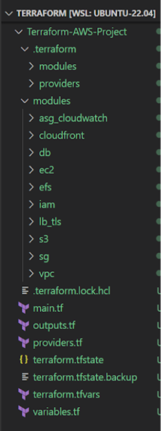
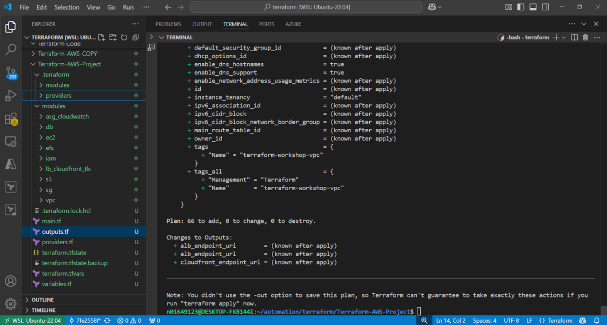
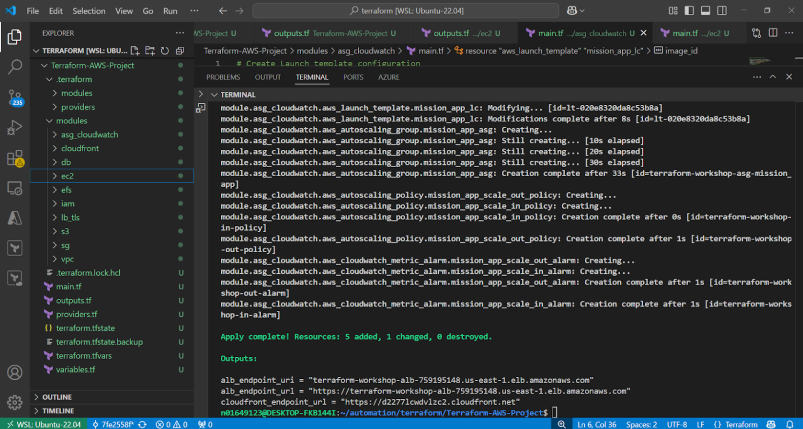
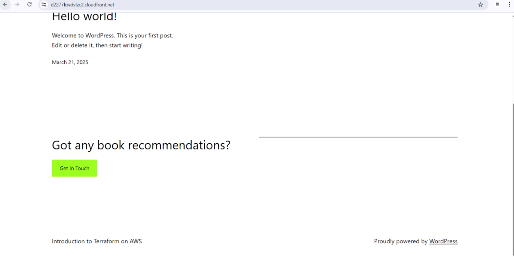
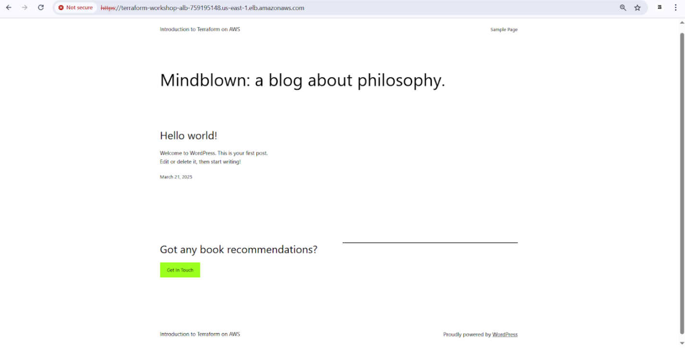
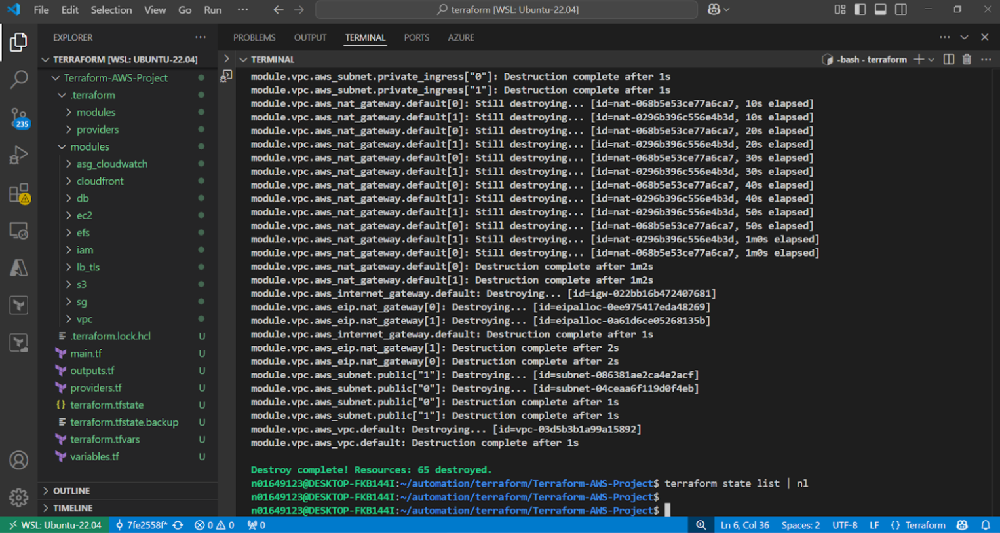

# Project README: Terraform AWS Workshop

## Introduction

This Terraform project is based on the AWS Workshop from AWS (https://catalog.workshops.aws/terraform101/en-US/0-introduction), designed to help you gain hands-on experience using Terraform to deploy infrastructure on AWS. The goal of this workshop is to build and automate the provisioning of a highly available WordPress application in AWS. The infrastructure is configured with key AWS services such as VPC, EC2, RDS, S3, EFS, CloudFront, and Load Balancer, and is optimized for auto-scaling, high availability, and fault tolerance.

Instead of using a single main.tf file, I've refactored the Terraform project into multiple reusable modules. Each module handles a specific part of the infrastructure (e.g., VPC, EC2, RDS, S3, etc.), improving organization, maintainability, and reusability of the code.

## Key AWS Services Used

- **VPC**: Defines networking with subnets across multiple Availability Zones.
- **EC2**: Scalable compute resources to run the WordPress app.
- **RDS**: Managed MySQL database with Multi-AZ replication.
- **S3**: Object storage for assets and backups.
- **EFS**: Shared file storage for EC2 instances.
- **CloudFront**: Content delivery network for faster access globally.
- **IAM**: Securely manage access to AWS resources.
- **Load Balancer (ALB)**: Distribute traffic across EC2 instances.

## Architecture


## Project Structure

The project is organized into Terraform modules:





## Getting Started

### Prerequisites

- Install **Terraform** and configure **AWS CLI** with your credentials.

### Steps

1. Clone the repository:
   ```bash
   git clone https://github.com/your-repository/terraform-aws-workshop.git
   cd terraform-aws-workshop
   ```

2. Update Input Variables: Modify the terraform.tfvars file to configure settings such as VPC CIDR block, instance types, and AWS region.


3. Initialize Terraform:
   ```bash
   terraform init
   ```

4. Validate and plan:
   ```bash
   terraform validate
   terraform plan
   ```
    

5. Apply the configuration:
   ```bash
   terraform validate
   terraform plan
   terraform apply
   ```

6. Type `yes` to confirm and apply the changes.

   
 



### Clean Up

To remove the created resources, run:

```bash
terraform destroy
```




## Conclusion

This project demonstrates using **Terraform** to deploy a **highly available WordPress app** on **AWS** with auto-scaling and fault tolerance. The modular approach allows easy management and extension of the infrastructure.
